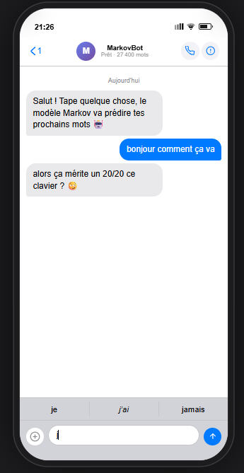

# ⌨️ Clavier Prédictif : Modèle de Markov

**Projet réalisé par :** Camille Barré • Lilou Slezack • Hugo Letassey

---
## 📸 Aperçu du Projet


---

## 📝 Présentation du Projet
Ce projet consiste en la création d'un clavier intelligent capable de prédire la suite de la saisie en temps réel. En utilisant des concepts mathématiques et algorithmiques, nous avons développé une interface interactive qui simule l'expérience de saisie sur smartphone.

### ✨ Fonctionnalités
* **Clavier Interactif :** Une interface visuelle simulant un clavier de téléphone.
* **Prédiction en temps réel :** Suggestions dynamiques basées sur votre saisie.
* **Système de Réponse :** Le projet intègre une fonctionnalité interactive où vous recevez une réponse automatique à vos messages. Essayez pour voir !

### ⚙️ Fonctionnement de la prédiction
L'algorithme analyse en temps réel la saisie de l'utilisateur pour offrir une double assistance :
* **Analyse par lettre :** À chaque lettre tapée, le modèle filtre les mots de la base de données pour aider à la complétion du mot en cours.
* **Analyse par mot :** Une fois un mot validé, l'algorithme propose les **trois mots les plus probables** pour la suite, basés sur les fréquences d'apparition observées dans notre corpus.

---

## 🧠 Le Modèle : Chaînes de Markov
Le cœur du projet repose sur les **Chaînes de Markov** de premier ordre. 

Le modèle considère que la probabilité qu'un mot apparaisse dépend du contexte précédent :
* **Transition :** Le passage d'un "état" (un mot) à un autre.
* **Probabilités statistiques :** Si dans notre corpus le mot "Hunger" est suivi 100 fois par "Games", le système calculera une probabilité de transition maximale pour ce couple et proposera "Games" en première position.

---

## 📊 La Dataset (Corpus d'entraînement)
Pour garantir des prédictions pertinentes, nous avons entraîné notre modèle sur un corpus de textes riche et varié, mêlant différents styles littéraires et époques :

* **Littérature Classique :** *Le Tour du monde en 80 jours* (Jules Verne) et les œuvres de la *Comtesse de Ségur*.
* **Littérature Contemporaine :** La saga *Hunger Games* (Tomes 1 et 2) ainsi que le thriller *La Femme de ménage* (Freida McFadden).
* **Langage Courant :** Un jeu de données de discussions quotidiennes et des articles d'actualité.

> ⚠️ **Note sur les biais :** Nous avons privilégié des textes longs pour avoir une base de données conséquente. Cependant, cela peut biaiser les prédictions (ex: noms de personnages récurrents). Pour un usage purement "SMS", il serait idéal d'utiliser uniquement des historiques de messagerie, mais l'utilisation d'œuvres littéraires permet ici de varier les types de langages et les sujets.

---

## 🚀 Installation et Lancement

### Pré-requis
* **Node.js** : Version **20.0.0** recommandée.
* Un gestionnaire de paquets (**npm**).

### ▶️ Lancer le code
Pour lancer le projet et accéder à l'affichage, assurez-vous d'être à la racine du dossier dans votre terminal, puis exécutez les commandes suivantes :
   ```bash
   nvm install 20 && nvm use 20
   npm install
   npm run dev
